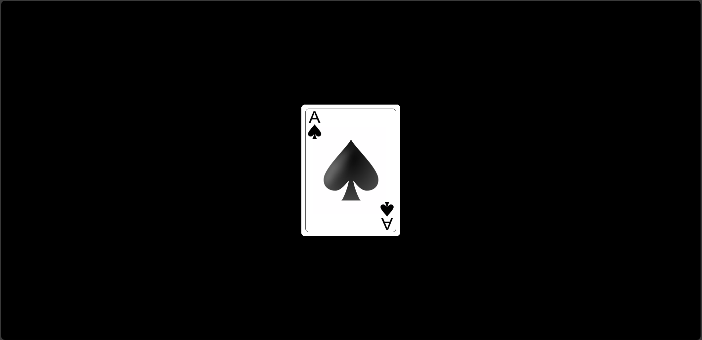
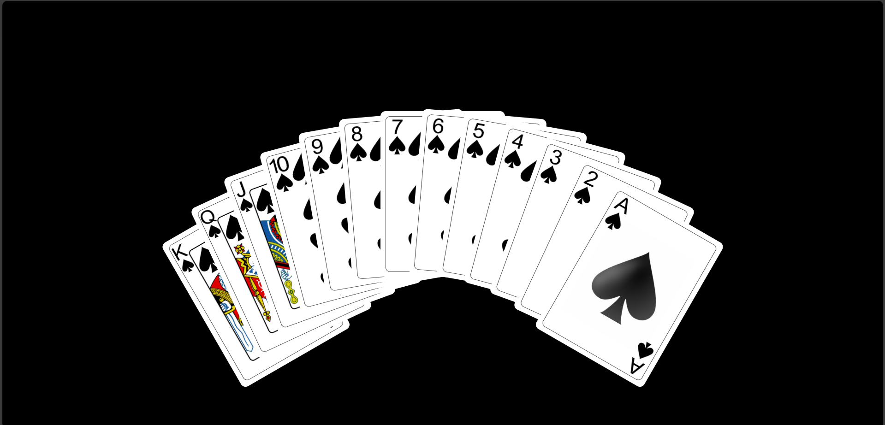
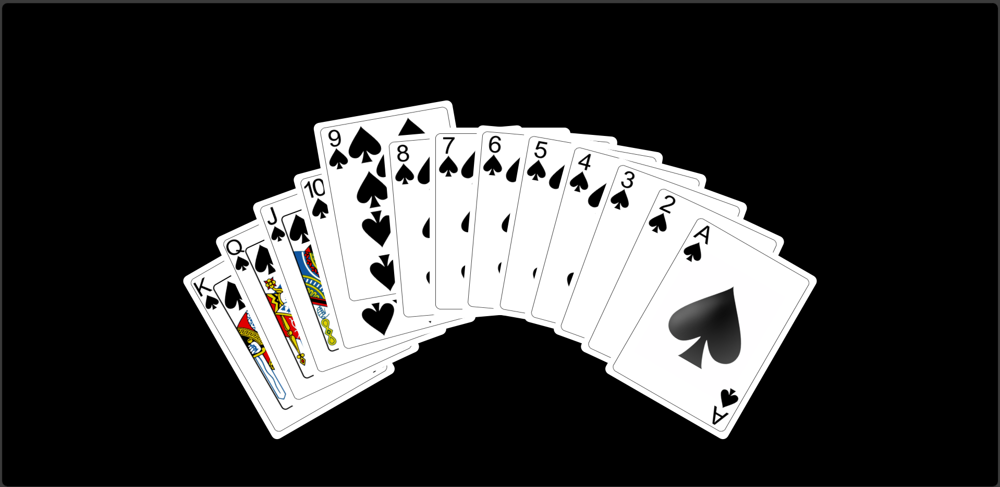

# Playing Cards

A simple web project that displays a stack of playing cards with a cool hover effect, created using HTML and CSS.

## Demo





## Features

- Display of a stack of playing cards.
- Hover effect that fans out the cards.
- Smooth transitions and animations.

## Technologies Used

- HTML
- CSS

## Setup

1. Clone the repository:

 git clone  ```sh
    https://github.com/Prateeksingchn/Playing-Cards-Hover-Effect
